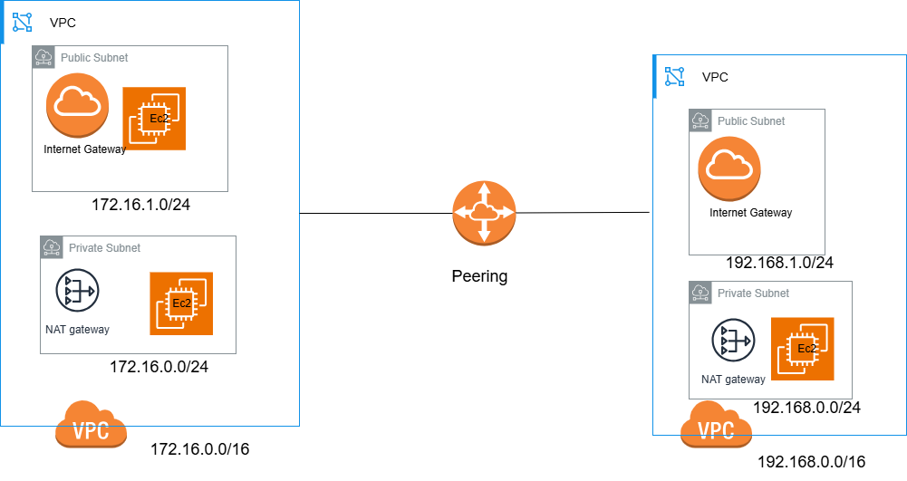
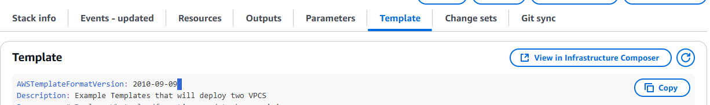
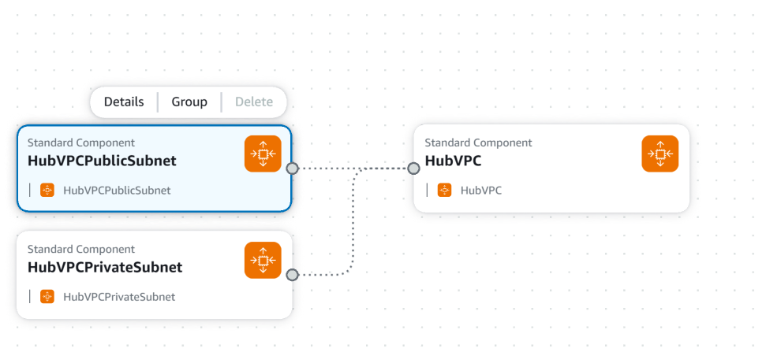
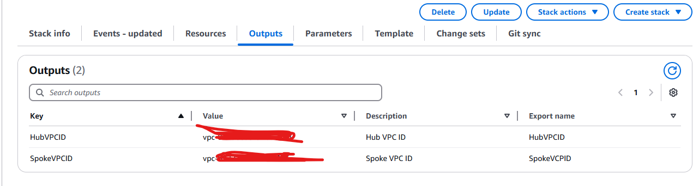
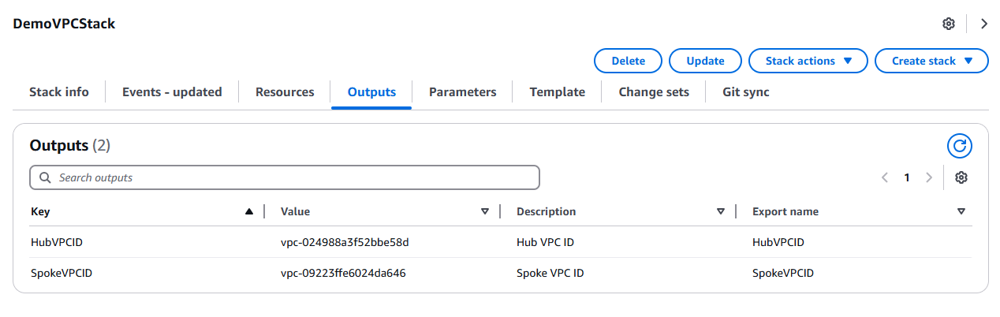
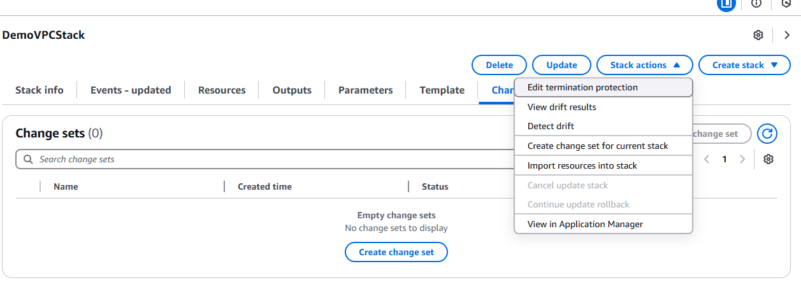
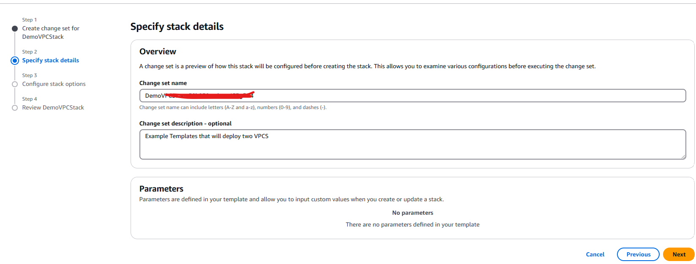
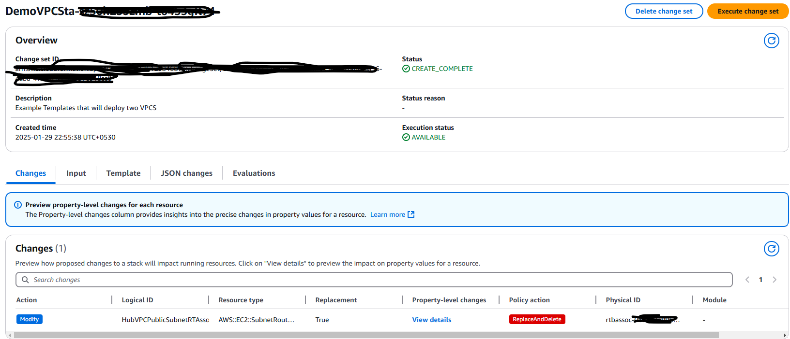
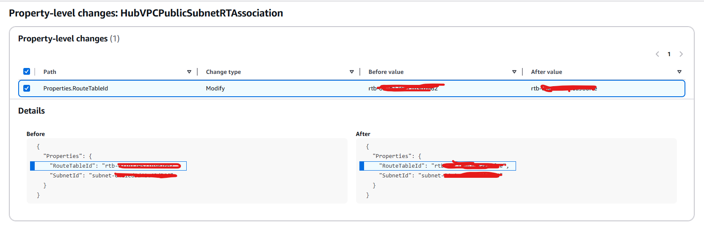

This is repo is created for Practising the CloudFormation. Templates in this repo will used to created below infrastructure.

It has Two VPC each has a public and private subnet. Public Subnet has a IGW and Nat Gateway. EC2 instances will be deployed to Each Subnet in order to test connectivity. SG will be deployed to allow traffic 

**Writing Basic Cloudformation Template**

In the CloudFormation Template Resource section describes what resource should be deployed.It is the one of mandatory parameters

Refer AWS documentation https://docs.aws.amazon.com/AWSCloudFormation/latest/UserGuide/aws-template-resource-type-ref.html for all the supported resources types and it is property types (Resource has multiple Properties for example VPC as CIDR,Subnet ..etc). 

IF we search here VPC resource will not be available. It is under EC2.

Parameters used pass user input to the template 
https://docs.aws.amazon.com/AWSCloudFormation/latest/UserGuide/parameters-section-structure.html  

Mappings are fixed variables in the Cloudformation template 
https://docs.aws.amazon.com/AWSCloudFormation/latest/UserGuide/mappings-section-structure.html 

Outputs used to declares output values that we can import into other cloudfromation stacks
https://docs.aws.amazon.com/AWSCloudFormation/latest/UserGuide/outputs-section-structure.html 

Instrinsic Func !Ref Can be used to reference 
1. Parameters 

2. Previously created resource 
    
Whenever Logical ID/Name is passed to Ref function resource ID is returned. See templates Ref function usage

Instrinsic Function Documentation: https://docs.aws.amazon.com/AWSCloudFormation/latest/UserGuide/intrinsic-function-reference.html

Ref Instrinsic Function Documentation: https://docs.aws.amazon.com/AWSCloudFormation/latest/UserGuide/intrinsic-function-reference-ref.

Examine vpc.yml for identify use of intrinsic function Ref usage, Creation of basic VPC template.

__Gett  Intrinsic Function Usage__

In each resource it has properties and return values. Properties used when creating resource specify certain things. For example if you are creating a vpc you specify address space.  Return values are values returned when resource is created for  example when it comes to  VPC certain things are returned such VPC ID. Those Return valus are required when provisioning certain resources.

If you pass Resource Logical ID and return value to GettAtt  function value is returned. 

For Example refer elastic IP creation and specify it with NAT Gateway in vpc.yml file or refer below documentation.
https://docs.aws.amazon.com/AWSCloudFormation/latest/UserGuide/aws-resource-ec2-natgateway.html 

In the NAT Gateway resource it requires the Allocation ID for the Elastic IP resource. Then What we have to do to is create the Elastic IP address.

Once Elastic IP address is created using GetAtt intrinsic function We specify the Allocation ID to the NAT Gateway Resource.

**Deploy CloudFormation Stack** 

Cloudformation is regional service. Let say we deploy via the portal. In this case you have to go to respective region and deploy from there. If you want to deploy same stack to multiple regions make sure to use parameters because it may have region values such as avaliability zones.

**Validate the Template Before Deployment** 
Use below command to validate 

aws cloudformation validate-template --template-body file://vpc.yml --region ap-southeast-2 --profile sa-development

**Update an exsisting Stack**

In order to try this out. In the vpc.yml which I used to create VPC stack I added another VPC and Add tags to exisisting resources because tags does not require replace. Once template is finalized go to the cloudfromation then select the relevant stack.

In stack click on update. Then Choose **Replace exisisting template** option. This is the only option that is available 

**Infrastructure Composer** 

In the Stack if we go to the template section We can see the Template which is used to provision the stack. In here if We click on "View in Infrastructure Composer" we can see graphical representation of resoruce 

**Managing Dependecny Between Resources** 

Situation where  Resource B depends on Resource A. When Cloudfromation try to deploy resources it is unable to identify which resource should deploy first. This where encounter an error saying **Circular dependency between resources:**. 
https://aws.amazon.com/blogs/infrastructure-and-automation/handling-circular-dependency-errors-in-aws-cloudformation/ 

In order to avoid this we have use DependsOn. This is similar with Terraform depends_on parameter. Refer Depends on Documentation below for clarity.
 https://docs.aws.amazon.com/AWSCloudFormation/latest/UserGuide/aws-attribute-dependson.html

 See vpc.yml on how we use Depends to avoid this error.

**Output and Imports in Cloudformation** 

Let say you have created VPC in one stack. Now you want to create route tables in another stack. In this scenario how to Pass VPCID in VPCStack to Route Table Stack. This is the place where output and import come into play.

Output Documentation: https://docs.aws.amazon.com/AWSCloudFormation/latest/UserGuide/outputs-section-structure.html 
Import Documentation: https://docs.aws.amazon.com/AWSCloudFormation/latest/UserGuide/intrinsic-function-reference-importvalue.html 

If you refer vpc.yml you can see that There is Seperate section called outputs after resource declaration.

Each Output has 

    1. Output Logical ID / Logical Name

    2. Description

    3. Value : Value of  the property returned. In here we want return VPC ID. So Passed VPC logical name as the value with Ref function. When Pass Ref function with LogicalName of the resource it Returns the Resource ID. So we pass the  Logical Name  of the VPC Resource so it should return VPCID.

    4. Export: Here specify name of the output. This name should be globally unique with in the region were cloudformation stack deployed. Using this name we can use this output in other stack

Once the template run in the cloudformation Console we can see the output values in the Outputs section in the stack.Refer below Screenshot.

__Import usage__

Once the outputs are defined it can be imported to other stack. If you look at **routetables.yml** which used to create RouteTable Stack using **ImportValue** Function and use the name of the outputs defined in the VPC stack (in the vpc.yml file) we have referenced the VPC ID for each 

**Change  Sets** 

Change sets allowed view what it is going happen when we are going to update an stack. So that we can update with confidence

Go to the Stack we are going to  update.Here you will see a tab for change sets. Refer below screenfor more clarity.

Click on it. If previously change sets was not created shows as "Empty Change set Create change set". Also you you can click on stack actions and then click on create change set for current stack. Select Either Option.

Then As usual select replace exsisting template. Refer below screenshot for more clarity

Then Have to give change set a name or can keep the automatically generated change set name. Refer below screenshot.In this case I have choose Automatically Generated name.

Keep Default options for "Configure Stack Options section". Then Review everything and click on Submit.

Then Change set will be created. It will show what are the changes going to happen.Refer below screenshot. Since I am updating route table association it will show route table ID. Keep Note that Logical ID/Name in the template also shown as property.

IF we click View Details can see what is going to be changed in more details as well.

IF you are ok with the change click on "Execute Change Set on top". After that it will update the stack